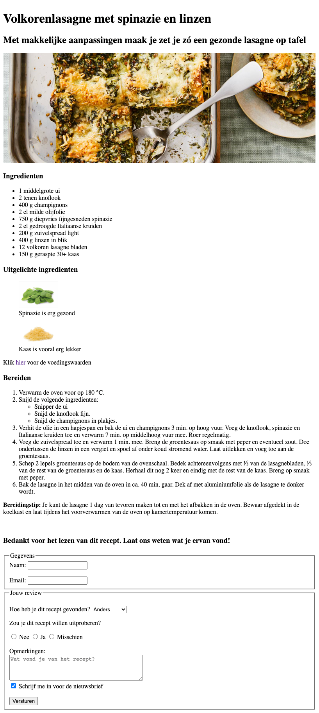

# Opdrachtbeschrijving

Je gaat een pagina opbouwen met HTML die er **exact** zo uit ziet zoals het voorbeeld hieronder. De gebruikte afbeeldingen kun je terugvinden in de map `assets`. De pagina's waarin jij jouw HTML gaat schrijven, kun je vinden in de map `pages`. **Je hoeft dus zelf geen nieuwe bestanden aan te maken!** 

Om je tijd te besparen staat onderaan de opdrachtbeschrijving ook de platte tekst, zodat je deze niet over hoeft te typen.

## Randvoorwaarden
* Je mag alleen HTML gebruiken (dus geen CSS!) 
* Je mag de de bestanden niet verplaatsen
* Gebruik de afbeeldingen uit de `assets` map

## Stappenplan
1. Begin bij `index.html`. Zorg dat de titel _"Volkorenlasagne met spinazie en linzen"_ in het browser-tabblad komt te staan
2. Voeg de titel, subtitel en afbeelding in. De afbeelding maak je `800px` breed. _Tip_: zien de elementen er niet uit zoals verwacht? Zoek dan eens op internet een voorbeeld van het gebruik van dat element op, en check of je geen foutjes hebt gemaakt in jouw schrijfwijze.
3. Maak de lijst met ingredienten en uitgelichte ingredienten. Zorg ervoor dat ook de afbeeldingen van de uitgelichte afbeelingen _onder_ elkaar komen te staan.
4. Maak het stappenplan voor het bereiden van het gerecht waarbij het snijden van de ingredienten in een unordered list staat.
5. In de footer kun je het contactformulier plaatsen. Als form action kun je voor nu Als form action mag je voor nu `http://www.voorbeeld.nl/review.php` gebruiken. Zorg ervoor dat het vinkje bij 'Schrijf me in voor de nieuwsbrief' al aangevinkt staat.
6. Maak een link naar de pagina `voedingswaarden.html` en zorg dat hij opent in een nieuw venster. Neem de tabel uit de dummy tekst en schrijf dit om naar HTML. Dit zal er ietsje anders uitzien dan de tabel uit de opdrachtbeschrijving, omdat die tabel in _markdown_ is geschreven.

## Hoe de pagina eruit komt te zien

## Dummy tekst

### Ingredienten
1 middelgrote ui
2 tenen knoflook
400 g champignons
2 el milde olijfolie
750 g diepvries fijngesneden spinazie
2 el gedroogde Italiaanse kruiden
200 g zuivelspread light
400 g linzen in blik
12 volkoren lasagne bladen
150 g geraspte 30+ kaas

### Bereiden
Verwarm de oven voor op 180 °C. 
Snijd de volgende ingredienten: Snipper de ui. Snijd de knoflook fijn. Snijd de champignons in plakjes. Verhit de olie in een hapjespan en bak de ui en champignons 3 min. op hoog vuur. Voeg de knoflook, spinazie en Italiaanse kruiden toe en verwarm 7 min. op middelhoog vuur mee. Roer regelmatig.

Voeg de zuivelspread toe en verwarm 1 min. mee. Breng de groentesaus op smaak met peper en eventueel zout. Doe ondertussen de linzen in een vergiet en spoel af onder koud stromend water. Laat uitlekken en voeg toe aan de groentesaus.

Schep 2 lepels groentesaus op de bodem van de ovenschaal. Bedek achtereenvolgens met ⅓ van de lasagnebladen, ⅓ van de rest van de groentesaus en de kaas. Herhaal dit nog 2 keer en eindig met de rest van de kaas. Breng op smaak met peper.

Bak de lasagne in het midden van de oven in ca. 40 min. gaar. Dek af met aluminiumfolie als de lasagne te donker wordt.

Bereidingstip:
Je kunt de lasagne 1 dag van tevoren maken tot en met het afbakken in de oven. Bewaar afgedekt in de koelkast en laat tijdens het voorverwarmen van de oven op kamertemperatuur komen.

### Uitgelichte ingredienten
* Spinazie is erg gezond
* Kaas is vooral erg lekker

### Voedingswaarden tabel
| Voeding       | Waarde    |
|---------------|-----------|
| energie       | 630 kcal  |
| koolhydraten  | 57 g      |
| natrium       | 520 g     |
| eiwit         | 33 g      |  
| vet           | 26 g      |

_*Let op_: deze tabel is in markdown geschreven. Wanneer je dit in HTML maakt, zal de tabel er net ietsje anders uitzien.